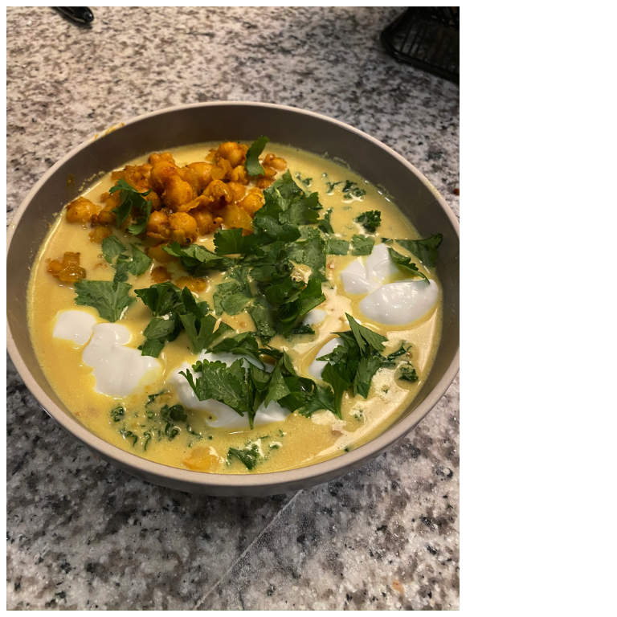

## Ingredients

| | |
|---|---:|
olive oil | as needed
garlic | 4 cloves
onion | 1
ginger | 2 inch piece
turmeric | 1.5 tsp
red pepper flakes | as needed
chickpeas | 2 15oz cans
coconut milk | 2 15oz cans
chicken stock | 2 cups
kale | 1 bunch
cilantro | to taste
yogurt | to taste

## Directions

1. cook garlic, onion, ginger in olive oil
2. add turmeric, red pepper flakes
3. cook chickpeas until slightly crispy
3. set aside some chickpeas
4. add coconut milk && chicken stock
5. add kale, cook until soft
6. serve with set-aside chickpeas, yogurt, cilantro
